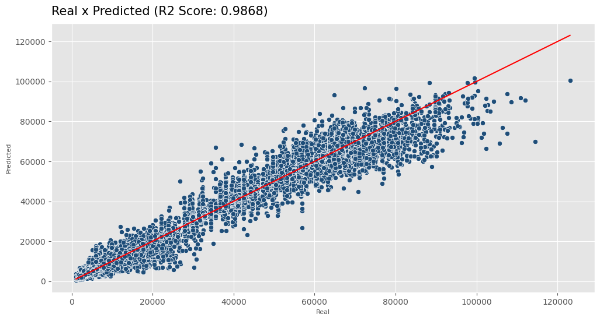
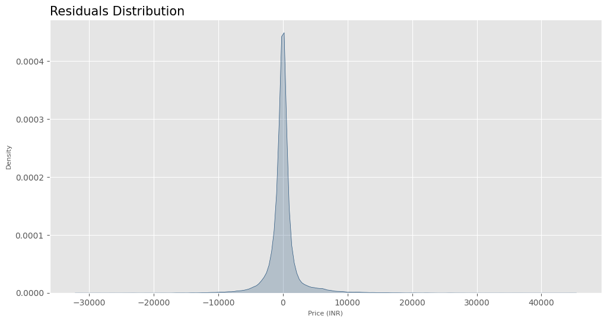

# Flight Price Prediction with XGBoost 🛫

### Content
- [Introduction](#Introduction)
- [Project goals](#project-goals)
- [Data](#data)
- [Methods and models](#methods-and-models)
- [Results](#results)
- [Tools of work](#tools-of-work)
- [Contact me](#contact)

## Introduction
Dataset contains information about flight booking options from the website Easemytrip for flight travel between India's top 6 metro cities. There are 300261 datapoints and 11 features in the cleaned dataset. 

## Project goals
Our goals is to (1) answer the business questions proposed and (2) to build a machine learning model to predict flight prices.

#### Business questions
- Does price vary with Airlines?
- How is the price affected when tickets are bought in just 1 or 2 days before departure?
- Does ticket price change based on the departure time and arrival time?
- How the price changes with change in Source and Destination?
- How does the ticket price vary between Economy and Business class?

## Data

|Column|Description|
|---|---|
|``airline``|Airline company|
|``flight``|Flight code|
|``source_city``|Source city|
|``departure_time``|Departure time|
|``stops``|Number of stops|
|``arrival_time``|Arrival time|
|``destination_city``|Destination city|
|``class``|Ticket class|
|``duration``|Flight duration|
|``days_left``|Days between booking and travel|
|``price``|Ticket price (target)|

The dataset is available in [Kaggle](https://www.kaggle.com/datasets/shubhambathwal/flight-price-prediction) and was uploaded by Shubham Bathwal.

## Methods and models
####  Pre-processing
- Scikit-learn, Optuna, Category Encoders, Feature Engine.
#### Models
- XGBoost.
#### Metrics
- Mean Squared Error, Root Mean Squared Error, Mean Absolute Error, Mean Absolute Percentage Error, R2 Score.

## Results
### Answering the business questions
- Price varies with class and airline, especially with class. In the case of airlines, there is a significant difference when we consider Vistara and Air India;
- Kolkata and Chennai are the most expensive destinations;
- For arrival time, evening and morning have the highest prices, and for departure, morning and night do;
- Buying tickets in advance is the best way to get good prices.

### Machine learning model
#### Metrics
|Metric|Result|
|---|---|
|**MSE**|6855205.6699|
|**RMSE**|2618.2448|
|**MAE**|1328.5562|
|**MAPE**|0.0962|
|**R2 Score**|0.9868|

#### Cross-validation results
|Metric|Result|
|---|---|
|**General Mean MAE**|1377.5180|
|**MAE Standard Deviation**|10.8035|

#### Visualizations

## Tools of work

## Contact
- **E-mail:** andreluizlcons@gmail.com
- **LinkedIn:** https://www.linkedin.com/in/andreluizls1/
- **Phone** +55 88 999934237